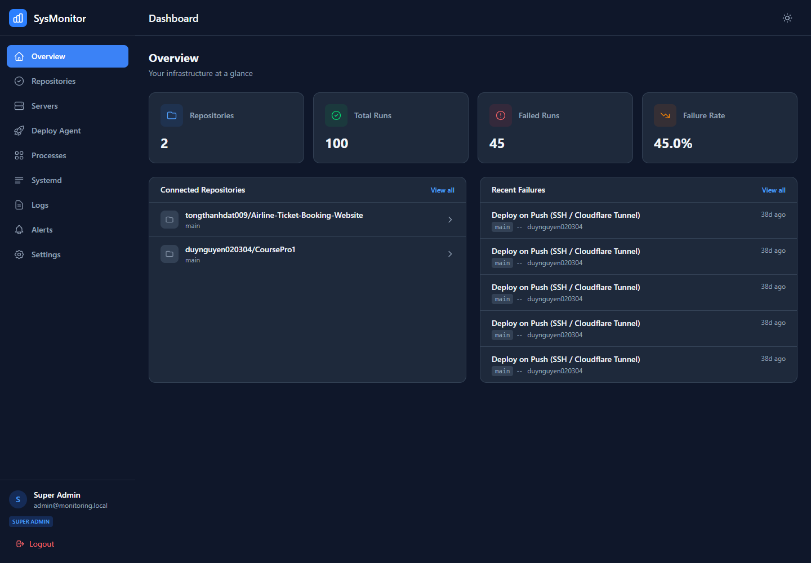
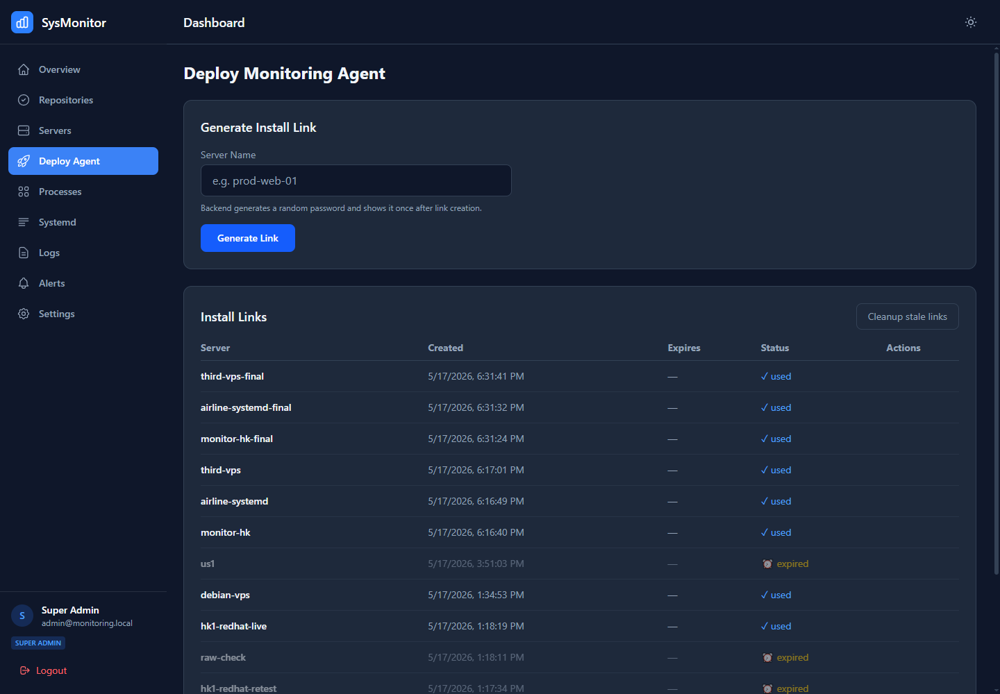
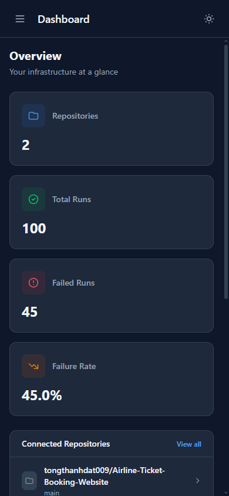

# SysOps DevOps Monitor

SysOps DevOps Monitor is an infrastructure monitoring platform for DevOps teams: overview dashboards, GitHub Actions monitoring, server health, PM2/systemd runtime visibility, logs/audit trails, alerting, RBAC, and monitoring agent deployment.

## Application UI

### Dashboard desktop



### Deploy agent desktop



### Dashboard mobile



## Dashboard access

Production URL:

```text
https://monitor-system.shiphard.studio/
```

Seeded super admin account:

```env
SUPER_ADMIN_EMAIL=admin@monitoring.local
SUPER_ADMIN_PASSWORD=123456
```

> Note: this password is for demo/dev only. For real production use, rotate `SUPER_ADMIN_PASSWORD`, `JWT_SECRET_KEY`, DB password, and agent token.

## Project features

- **Overview dashboard**: repository count, total workflow runs, failed runs, failure rate, recent repositories and failures.
- **Repositories**: connect GitHub repositories and sync workflow runs, logs, and stats.
- **Servers**: manage servers with installed agents, health status, heartbeat, OS, and agent version.
- **Deploy Agent**: generate install links/tokens, one-time download passwords, and manage used/expired/revoked links.
- **Processes**: view PM2 processes and systemd services by server, with status/type/server filters and search.
- **Systemd**: inspect service state, request snapshots, and read service logs.
- **Logs**: search audit, process, and system logs.
- **Alerts**: view active/resolved alerts and alert rules for GitHub Actions, PM2, and server metrics.
- **Settings/RBAC**: manage users, roles, and permissions; super admin has full access.
- **Agent update/cleanup**: publish agent releases, assign updates, and clean up stale install tokens/servers.

## Project logic

```text
Vue 3 SPA
  -> Pinia auth/store
  -> Axios API client + JWT Bearer + refresh token
  -> ASP.NET Core API controllers
  -> Services/domain logic
  -> EF Core PostgreSQL
  -> Redis cache for workflow logs
  -> Background workers for sync/evaluation/cleanup
  -> Monitoring Agent sends heartbeats/metrics/logs/process snapshots
```

Main flow:

1. User signs in with email/password.
2. API returns a JWT, refresh token, and user permissions.
3. Frontend route guards check auth and permissions before opening screens.
4. Dashboard calls repository/server/alert/log APIs according to the user's permissions.
5. Agent installed on each server sends metrics, PM2/systemd snapshots, and logs to the API.
6. Background services sync GitHub data, aggregate metrics, clean up logs/tokens, and evaluate alert rules.
7. Alert rules create alerts when workflow, process, or server conditions cross configured thresholds.

## Project structure

```text
.
├── frontend/                 # Vue 3 + Vite + Pinia + Tailwind
│   ├── src/views/            # Pages: Overview, Repositories, Servers, Deploy, PM2, Systemd, Logs, Alerts, Settings
│   ├── src/components/       # Layout, charts, logs, alerts, common UI
│   ├── src/stores/           # Pinia stores: auth, repos, servers, metrics, logs, alerts, pm2
│   ├── src/router/           # Vue Router + auth/permission guards
│   └── src/lib/api.ts        # Axios client + API modules
├── backend/                  # ASP.NET Core + EF Core
│   ├── Monitoring.Api/       # Controllers, middleware, startup, hosted services registration
│   ├── Monitoring.Core/      # Entities, DTOs, enums, interfaces
│   └── Monitoring.Infrastructure/
│       ├── Data/             # DbContext, migrations, RBAC seeder
│       ├── Services/         # Auth, GitHub, deploy, metrics, logs, PM2, alert services
│       └── BackgroundServices/ # sync/aggregation/retention/alert workers
├── agent/                    # Node/TypeScript monitoring agent
├── docs/screenshots/         # README screenshots captured by Patchright MCP
├── docker-compose.yml        # Postgres + Redis local dependencies
└── prd.md                    # Product requirements/spec
```

## Tech stack

- Frontend: Vue 3, Vite, TypeScript, Pinia, Vue Router, Tailwind CSS, Axios.
- Backend: ASP.NET Core, EF Core, PostgreSQL, Redis, JWT auth, Swagger.
- Agent: Node.js/TypeScript, Axios, Vitest.
- Infra/dev: Docker Compose for Postgres + Redis.

## Local setup

### 1. Start dependencies

```bash
docker compose up -d
```

### 2. Backend env

```bash
cp backend/.env.example backend/.env
```

Update required values:

```env
DB_HOST=localhost
DB_PORT=5432
DB_NAME=monitoring
DB_USER=postgres
DB_PASSWORD=postgres
JWT_SECRET_KEY=YourSuperSecretKeyThatIsAtLeast32CharactersLong!
SUPER_ADMIN_EMAIL=admin@monitoring.local
SUPER_ADMIN_PASSWORD=123456
REDIS_CONNECTION=localhost:6379
```

### 3. Run API

```bash
cd backend/Monitoring.Api
dotnet restore
dotnet run --urls http://localhost:5000
```

The API automatically runs EF migrations and seeds RBAC/super admin on startup.

### 4. Run frontend

```bash
cd frontend
npm install
npm run dev
```

Open:

```text
http://localhost:5173
```

## Build/test

Frontend:

```bash
cd frontend
npm run build
```

Backend:

```bash
cd backend
dotnet build Monitoring.slnx
```

Agent:

```bash
cd agent
pnpm install
pnpm test
pnpm build
```

## API notes

Frontend API base:

```env
VITE_API_URL=http://localhost:5000
```

If `VITE_API_URL` is not set, the frontend uses relative `/api`; Vite proxies it to `http://localhost:5000` in dev.

## License

MIT
